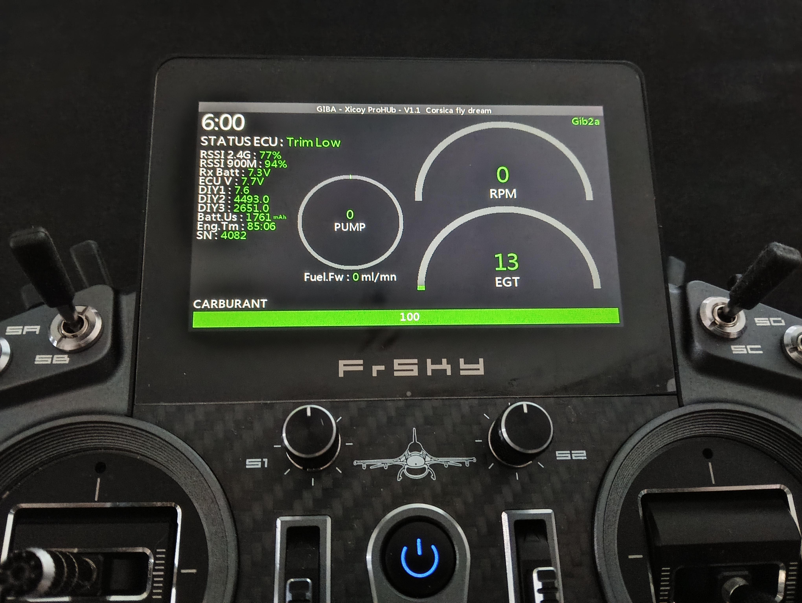

# GIB2A FrSky ETHOS Turbine Telemetry

GIB2A V26.3.0 est un widget Lua de télémétrie uniquement pour les radios FrSky
ETHOS. Il affiche la télémétrie turbine et ECU ; il ne démarre, n’arrête, ne
redémarre et ne commande jamais une turbine.

[Read in English](README.md)

## Fonctions

- Tableau de bord lisible en vol : RPM, EGT, carburant, pompe et statut ECU
- Nouveau tableau de bord avec statut ECU et chrono centralisés
- Logo GIB2A PNG externe
- Panneaux télémétriques gauche et droit à typographie adaptative
- Nouveau rendu RPM, EGT, pompe et carburant
- Modes Xicoy Basic, Extended et Maximum avec auto-bind AppID correspondant
- Auto-bind Enjet DTA
- Affectation manuelle des sources pour chaque ECU pris en charge
- Conversion du radio THR ETHOS de `-1024..+1024` vers `0..100 %`
- Sources ECU THR et Heli/TP RPM
- Fuel Level After Restart pour Xicoy
- Thèmes standard, contraste élevé et ambre
- Callouts fixes de carburant à 50 % et 25 %
- Alertes configurables, avec valeurs par défaut de 35 % et 15 %
- Alarmes de statut FlameOut et Restart configurables

## Compatibilité

| Marque | Statuts ECU | Affectation manuelle | Auto-bind | Modes spécifiques |
|---|---|---|---|---|
| Xicoy | Oui | Oui | Oui | Basic, Extended, Maximum |
| Enjet | Oui | Oui | Oui | DTA |
| Linton | Oui | Oui | Non | Sources manuelles |
| KingTech | Oui | Oui | Non | Sources manuelles |
| Swiwin | Oui | Oui | Non | Sources manuelles |
| JetCat | Oui | Oui | Non | Sources manuelles |

GIB2A est un projet indépendant sans affiliation avec les fabricants cités.
Aucun fabricant n’a officiellement certifié ce logiciel sauf mention explicite.
La compatibilité JetMunt n’est pas revendiquée faute de démonstration.

## Installation

Pour l’installation manuelle, extraire le paquet SD afin d’obtenir exactement
`SCRIPTS/GIB2A/main.lua` et
`SCRIPTS/GIB2A/gib2a_logo_ethos_180.png`, redémarrer la radio puis ajouter le
widget `GIB2A`.
Pour ETHOS Suite, utiliser l’archive Suite dédiée dont le schéma de manifeste et
la structure à la racine proviennent du paquet officiel V1.1. Voir
[Installation](docs/INSTALLATION.md).

## Configuration et télémétrie

Choisir la marque ECU et le mode, découvrir les capteurs dans ETHOS, employer
l’auto-bind disponible puis vérifier chaque source. Xicoy propose Basic, Extended
et Maximum avec auto-bind correspondant. Enjet possède son auto-bind DTA. Linton,
KingTech, Swiwin et JetCat utilisent principalement l’affectation manuelle.
Après redémarrage de l’ECU ou du simulateur, relancer si nécessaire la découverte
de télémétrie ETHOS. Voir [Configuration](docs/CONFIGURATION.md).

## Alarmes et sécurité

Les callouts fixes carburant sont à 50 % (jaune) et 25 % (rouge) ; les alertes
configurables valent par défaut 35 % et 15 %. FlameOut et Restart détectent des
transitions valides après un état moteur en fonctionnement. Restart ne déclenche
aucun redémarrage. Les alarmes ne remplacent pas la surveillance du pilote et les
procédures fabricants restent prioritaires. Voir [Avertissement](docs/DISCLAIMER.md).

## Documentation

- [Dépôt du projet](https://github.com/GIB2A/GIB2A-FrSky-ETHOS-Turbine-Telemetry)
- [Versions publiées](https://github.com/GIB2A/GIB2A-FrSky-ETHOS-Turbine-Telemetry/releases)
- [Version V26.3.0](https://github.com/GIB2A/GIB2A-FrSky-ETHOS-Turbine-Telemetry/releases/tag/v26.3.0)
- [Compatibilité](docs/COMPATIBILITY.md)
- [Configuration](docs/CONFIGURATION.md)
- [Installation](docs/INSTALLATION.md)
- [Dépannage](docs/TROUBLESHOOTING.md)
- [Notes V26.3.0](docs/release-notes/V26.3.0.md)
- [Contribuer](docs/CONTRIBUTING.md)

Signaler un problème via les [issues GitHub](https://github.com/GIB2A/GIB2A-FrSky-ETHOS-Turbine-Telemetry/issues).
